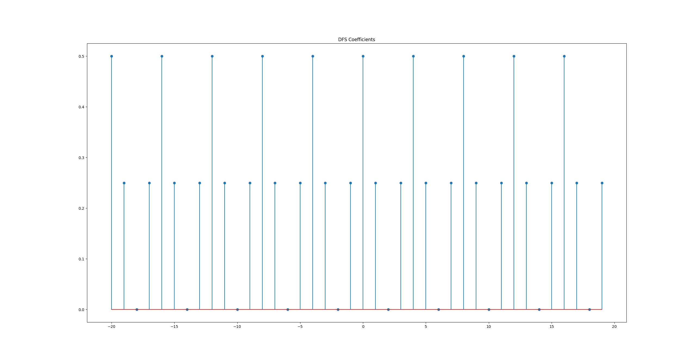
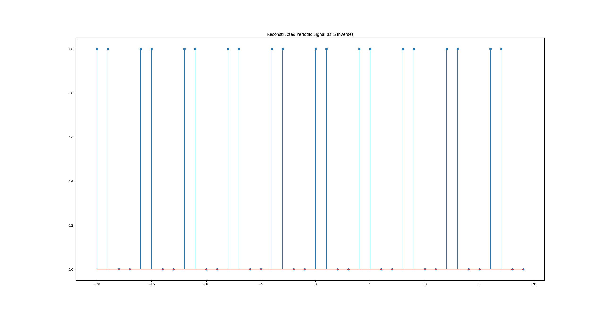
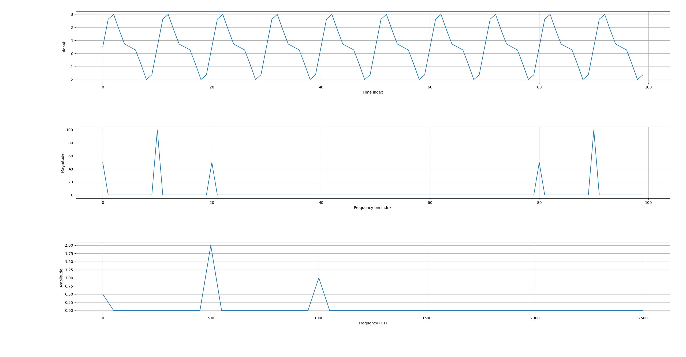
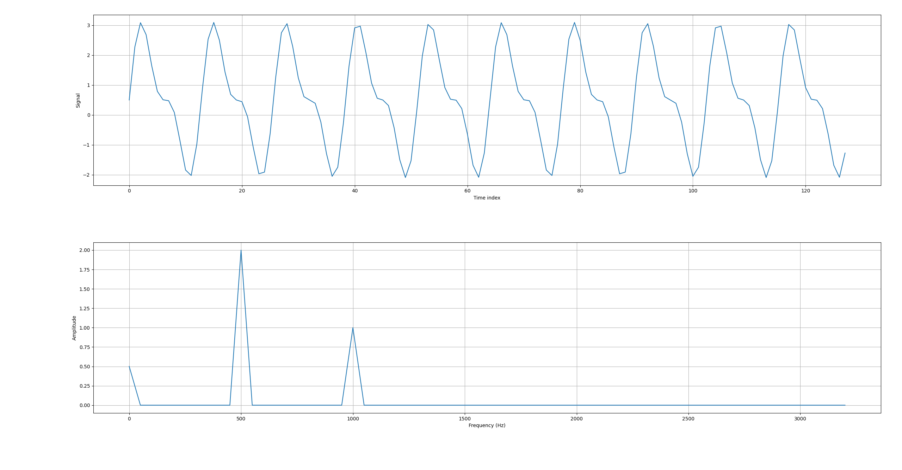
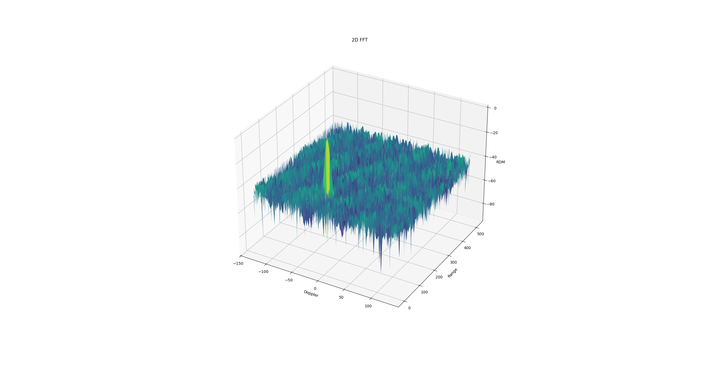
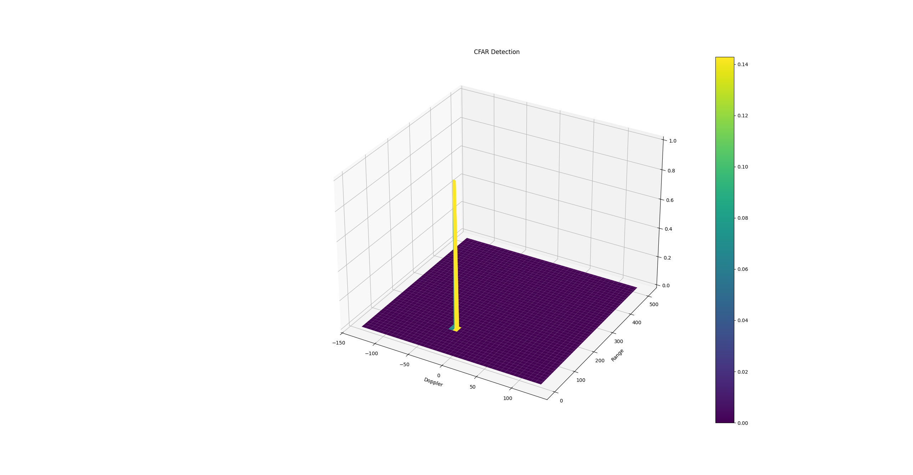

# FMCW Signal Process Toolkit

A lightweight Python toolkit for FMCW radar signal processing, implementing a full pipeline from signal generation to target detection.

---

## 📡 Pipeline

FMCW Signal Generation → Beat Signal → Range FFT (1D FFT) → Range-Doppler Map (2D FFT) → CA-CFAR Detection → Target Detection

---

## 🧠 Algorithms Implemented

### Fourier Transform
- DFS
- DFT (O(N²) matrix method)
- FFT (Cooley–Tukey, O(N log N))

### Detection
- CA-CFAR (Cell Averaging CFAR)

---

## 📊 Results  

### Fourier Transform

| DFS Coefficients | DFS Reconstruction |
|----------------|------------------|
|  |  |

| DFT Spectrum | FFT Spectrum |
|-------------|-------------|
|  |  |

---

### Radar Pipeline

| Range-Doppler Map | CFAR Detection |
|------------------|---------------|
|  |  |

## 🚀 Quick Start

```bash
git clone https://github.com/LukeJia47/fmcw-signal-process-toolkit
cd fmcw-signal-process-toolkit
pip install -r requirements.txt
python pipeline/radar_pipeline.py
```

## 📦 Requirements

- Python ≥ 3.8
- NumPy
- Matplotlib

---

## 🎯 Purpose

- FMCW radar signal processing learning
- Range-Doppler visualization
- CFAR detection understanding
- Algorithm validation and verification